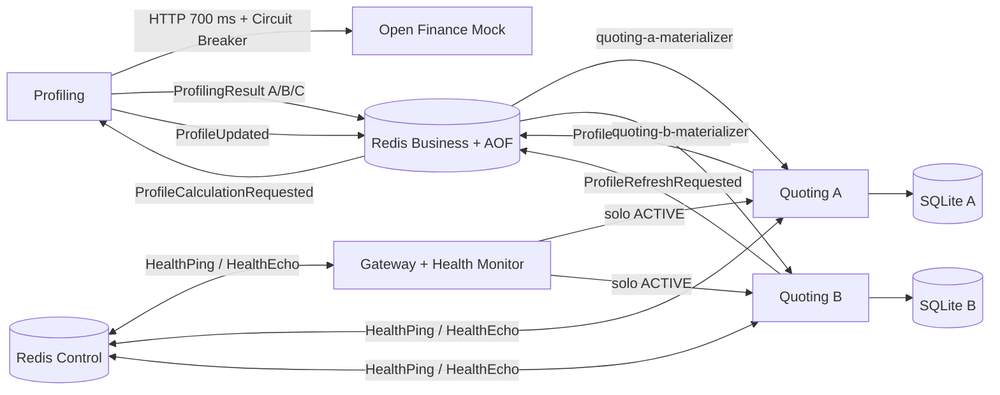

# Solventa Availability Experiment

Experimento reproducible para evaluar si transferencia de estado, vistas materializadas locales y detección asíncrona de fallas sostienen el journey de Cotización bajo las condiciones definidas para ASR-02 y ASR-05.

El resultado de una ejecución representa evidencia dentro del entorno evaluado. No equivale a una predicción de disponibilidad mensual en producción.

## Hipótesis

- H1, transferencia de estado: un `ProfileUpdated` durable permite cotizar desde SQLite local cuando Profiling está temporalmente indisponible.
- H2, detección: Ping-Echo por el plano de control retira una réplica que no responde dentro de la ventana configurada.
- H3, reintegro: una réplica recuperada pasa por `DOWN -> SHADOW -> ACTIVE` antes de recibir tráfico autoritativo.
- H4, votación: A/B/C publican resultados correlacionados y el Validator decide por consenso o timeout sin mezclar ejecuciones.

## Arquitectura



### Componentes

| Componente | Responsabilidad | Estado |
|---|---|---|
| `redis-business` | Streams de negocio con AOF y volumen persistente | Durable dentro del montaje local |
| `redis-control` | Pub/Sub efímero de HealthPing/HealthEcho | Separado del plano de negocio |
| `open-finance-mock` | Modos determinísticos NORMAL, SLOW, HTTP_500, TIMEOUT y DOWN | Inyección controlada |
| `profiling` | Circuit Breaker, caché, estrategias A/B/C, Validator y `ProfileUpdated` | Command + Query experimental |
| `quoting-a/b` | Materializador independiente y journey EDA desde SQLite | Read model local por réplica |
| `gateway` | Routing ACTIVE, failover único, retiro y SHADOW | Health Monitor incluido |

## Decisiones verificables

### Vista local e idempotencia

Cada réplica monta un volumen diferente y configura su propio `SQLITE_PATH`. La tabla `profile_view` nunca se consulta en Redis durante una cotización. La aplicación de eventos usa una transacción `BEGIN IMMEDIATE`, registra `eventId` y solo actualiza cuando la versión entrante es mayor.

Un perfil inexistente o vencido produce `503` con `NO_VALID_PROFILE_AVAILABLE` o `PROFILE_EXPIRED`. `MAX_PROFILE_AGE_SECONDS=300` es un umbral experimental configurable, no un requisito oficial.

### Consumer groups

`quoting-a-materializer` y `quoting-b-materializer` son grupos diferentes. Ambos reciben cada `ProfileUpdated`. Los pendientes se reclaman con `XAUTOCLAIM` después de `PENDING_CLAIM_IDLE_MS`; nunca se utiliza `min_idle_time=0`.

### Journey EDA y baseline síncrono

- `GET /quotes/{customerId}` consulta SQLite local.
- `POST /quotes/{customerId}/request-refresh` publica `ProfileRefreshRequested`.
- `GET /sync/quotes/{customerId}` llama a Profiling y existe únicamente para demostrar la propagación de fallas de la arquitectura anterior.

### Circuit Breaker y fallback

Profiling limita Open Finance mediante `OPEN_FINANCE_TIMEOUT_MS`. Después de `CB_FAILURE_THRESHOLD`, el circuito pasa a OPEN. Al finalizar `CB_RECOVERY_TIMEOUT_SECONDS`, permite una sola prueba HALF_OPEN. Si existe caché vigente, estrategia A usa `CACHE`; si no existe, A reporta error y la política 2/3 todavía puede decidir con B/C.

### Votación por eventos

Cada cálculo publica `ProfileCalculationRequested`. A, B y C consumen mediante grupos independientes y publican `ProfilingResult`. El Validator agrupa por `correlationId`, espera hasta `VOTING_TIMEOUT_MS` y busca el grupo mayoritario dentro de `VOTING_TOLERANCE`.

Para `40, 40, 90`, el resultado es `40` y C queda como outlier. Para `40, 40, timeout`, A/B forman consenso y C aparece en `missingStrategies`.

### Health, failover y SHADOW

El Gateway envía HealthPing por Redis Control. Dos ausencias consecutivas, con la configuración incluida, cambian la réplica a DOWN. El routing utiliza exclusivamente instancias ACTIVE.

Si una instancia falla antes de quedar DOWN, el Gateway hace un solo reintento ante error de transporte contra otra instancia ACTIVE. Una réplica recuperada entra en SHADOW. Los GET autoritativos se comparan con respuestas shadow; la promoción requiere health checks suficientes, tiempo mínimo, validaciones y cero diferencias.

El Docker healthcheck comprueba infraestructura del experimento. Ping-Echo es la táctica arquitectónica bajo evaluación; cumplen objetivos diferentes.

## Ejecución

### Requisitos

- Docker Desktop con Docker Compose.
- Python 3.10 o superior para scripts y pruebas locales.

```bash
git checkout feature/mejoras-experimento
docker compose up --build -d --wait
docker compose ps
```

Puertos host: Gateway `8080`, Profiling `7500`, Quoting A `7002`, Quoting B `7001`, Open Finance `6000`, Redis Business `6379` y Redis Control `6380`. Quoting A usa `7002` porque macOS suele reservar `7000` para Control Center; dentro de Docker ambas réplicas escuchan en `7000`.

Comprobación inicial:

```bash
curl -s -X POST http://localhost:7500/profiles/C001/refresh | python -m json.tool
curl -s http://localhost:7002/materialized-profiles/C001 | python -m json.tool
curl -s http://localhost:7001/materialized-profiles/C001 | python -m json.tool
curl -s http://localhost:8080/quotes/C001 | python -m json.tool
```

## Pruebas automatizadas

```bash
python -m venv .venv
source .venv/bin/activate
pip install -r requirements-dev.txt
pytest -v
```

Con el stack levantado:

```bash
RUN_INTEGRATION=1 pytest -m integration -v
```

Las pruebas unitarias cubren Circuit Breaker, versionado/idempotencia, consenso y la máquina `ACTIVE/DOWN/SHADOW`. Las pruebas de arquitectura verifican separación de buses, grupos y volúmenes independientes, ausencia de HTTP en el refresh EDA y failover acotado.

## Runner E0-E9

```bash
python scripts/run_experiment.py E0
python scripts/run_experiment.py E3
python scripts/run_experiment.py E5
python scripts/run_experiment.py E6
python scripts/run_experiment.py E7
python scripts/run_experiment.py E8
python scripts/run_experiment.py E9
python scripts/run_experiment.py all
```

Cada ejecución guarda `results/E<n>.json` y actualiza `results/summary.csv` y `results/acceptance_matrix.csv`. Un resultado PASS significa que el comportamiento observado cumplió el criterio programado para esa ejecución.

| Escenario | Falla o condición | Evidencia principal |
|---|---|---|
| E0 | Todo disponible | Disponibilidad, throughput, p50/p95/p99 |
| E1 | Open Finance DOWN | Fallback, circuito y continuidad |
| E2 | Open Finance lento | Timeout y contención de latencia |
| E3 | Profiling DOWN | EDA disponible y baseline síncrono fallando |
| E4 | Materializador A pausado | Pendientes reclamados y versiones A/B iguales |
| E5 | Quoting B DOWN | B retirado, failover y continuidad por A |
| E6 | Quoting B recuperado | Secuencia DOWN-SHADOW-ACTIVE |
| E7 | A=40, B=40, C=90 | C marcado como outlier |
| E8 | C no responde | Decisión A/B después del timeout |
| E9 | Redis Business DOWN | Cotización desde SQLite y salud por Redis Control |

## Carga con Locust

```bash
python -m venv .venv-locust
source .venv-locust/bin/activate
pip install -r load-tests/requirements.txt
TARGET_HOST=http://localhost:8080 CUSTOMER_POOL=C001,C002,C003 \
  locust -f load-tests/locustfile.py --users 20 --spawn-rate 5
```

Abre `http://localhost:8089`. Precarga los clientes con E0 antes de iniciar carga; los clientes sin perfil válido deben fallar funcionalmente y no se contabilizan como disponibilidad exitosa.

## Endpoints de control del experimento

Open Finance lento:

```bash
curl -s -X POST http://localhost:6000/admin/mode \
  -H 'Content-Type: application/json' \
  -d '{"mode":"SLOW","latencyMs":1500}'
```

Votación discrepante:

```bash
curl -s -X POST http://localhost:7500/admin/voting-scenario \
  -H 'Content-Type: application/json' \
  -d '{"A":{"mode":"NORMAL","score":40},"B":{"mode":"NORMAL","score":40},"C":{"mode":"NORMAL","score":90}}'
```

Estado del Gateway y métricas:

```bash
curl -s http://localhost:8080/gateway/status | python -m json.tool
curl -s http://localhost:7500/metrics | python -m json.tool
curl -s http://localhost:7002/metrics | python -m json.tool
```

Los endpoints `/admin/*` son exclusivos del mock y del entorno experimental.

## Criterios de aceptación

| Hipótesis | Escenario | Métrica | Criterio programado |
|---|---|---|---|
| H1 | E3 | availability | 100% para perfiles precargados; baseline sync falla |
| H1 | E4 | pending_recovered | Al menos un pendiente y misma versión final en A/B |
| H1 | E9 | availability | 100% para perfiles vigentes en SQLite |
| H2 | E5 | estado y disponibilidad | B=DOWN y 100% de cotizaciones funcionales |
| H3 | E6 | transiciones | SHADOW observado antes de ACTIVE |
| H4 | E7 | outlier | finalScore=40, outlierStrategies=[C] |
| H4 | E8 | timeout | finalScore=40, missingStrategies=[C], duración <2.5 s |
| Equipo | E0/E4 | propagación | p95 ≤2 s, umbral experimental |

## Logs y contratos

Los servicios imprimen JSON estructurado con timestamp, servicio, instancia, evento, correlación y resultado cuando aplica.

- Contratos: [docs/events.md](docs/events.md)
- Guion de video: [docs/video-demo.md](docs/video-demo.md)

## Limitaciones

- Redis Business usa AOF y un volumen local. Esto no demuestra durabilidad multi-región ni alta disponibilidad de un clúster Redis.
- Redis Control usa Pub/Sub efímero; perder mensajes de health forma parte de la semántica de detección.
- Las métricas residen en memoria y se reinician con cada contenedor.
- El runner genera evidencia en una sola máquina y durante intervalos cortos.
- Flask se ejecuta con su servidor integrado porque el objetivo es un experimento local, no un despliegue productivo.
- SQLite representa una vista local por réplica. El experimento no evalúa replicación de la base ni crecimiento masivo.

## Limpieza

```bash
docker compose down
```

Para eliminar también AOF, vistas SQLite y resultados de estado persistente de Docker:

```bash
docker compose down -v
```
