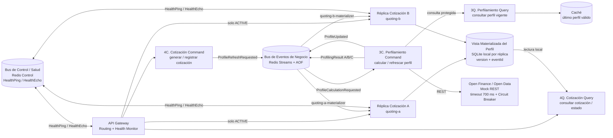

# Solventa: experimento de disponibilidad y resiliencia

Este repositorio contiene un experimento reproducible sobre la arquitectura de Solventa. La documentación utiliza los nombres del dominio para facilitar la explicación:

- **Cotización**: servicio que genera y consulta cotizaciones. En el código se identifica como `quoting`.
- **Perfilamiento**: servicio que calcula y actualiza el perfil de riesgo. En el código se identifica como `profiling`.
- **API Gateway**: punto de entrada, enrutamiento y monitoreo de las réplicas de Cotización.
- **Bus de Eventos de Negocio**: Redis Streams con AOF para transportar eventos de negocio.
- **Bus de Control / Salud**: Redis Pub/Sub para `HealthPing` y `HealthEcho`.
- **Vista Materializada del Perfil**: copia local del último perfil válido en SQLite de cada réplica de Cotización.

Los nombres técnicos (`quoting-a`, `quoting-b`, `profiling`, nombres de streams y rutas HTTP) se conservan en comandos y contratos para que la explicación pueda comprobarse directamente en el código.

El resultado de una ejecución representa evidencia dentro del entorno evaluado. No equivale a una predicción de disponibilidad mensual en producción.

## Hipótesis específica del experimento

### Hipótesis principal

**Si el perfil válido de un cliente se transfiere previamente mediante el Bus de Eventos de Negocio y se materializa en SQLite local en cada réplica de Cotización, entonces el journey de Cotización conservará su disponibilidad durante fallas temporales de Perfilamiento, Open Finance, el bus de negocio o una réplica de Cotización, sin depender de una llamada HTTP síncrona para cada cotización.**

La variable que modificamos es la falla introducida: proveedor externo caído o lento, Perfilamiento detenido, materializador pausado, réplica caída, estrategia de votación incompleta o Bus de Eventos de Negocio indisponible.

La variable que medimos es el comportamiento del journey: disponibilidad, categoría de resultado, latencia, uso de caché, estado del Circuit Breaker, recuperación de pendientes, consistencia de versiones, estado de las réplicas y decisión de votación.

### Hipótesis nula

**Si Cotización depende síncronamente de Perfilamiento, la caída de Perfilamiento u Open Finance hará que las cotizaciones fallen o que la latencia crezca sin control.**

La línea base síncrona se conserva en `GET /sync/quotes/{customerId}` únicamente para contrastarla con el flujo basado en eventos y la vista local.

### Hipótesis verificables

- **H1 — Transferencia y continuidad:** un evento `ProfileUpdated` durable permite consultar una cotización desde la Vista Materializada del Perfil aunque Perfilamiento esté temporalmente indisponible.
- **H2 — Detección y retiro:** el Bus de Control / Salud detecta una réplica que no responde y el API Gateway la retira del tráfico autoritativo.
- **H3 — Reintegro seguro:** una réplica recuperada debe pasar por `DOWN → SHADOW → ACTIVE`; durante `SHADOW` sus respuestas se validan, pero no son autoritativas.
- **H4 — Consenso tolerante:** las estrategias A, B y C publican resultados correlacionados; el Perfilamiento decide por mayoría o por timeout sin mezclar ejecuciones concurrentes.

## Arquitectura conceptual



### Componentes y traducción al código

| Nombre conceptual | Nombre técnico | Responsabilidad |
|---|---|---|
| Nombre conceptual | Nombre técnico | Responsabilidad |
|---|---|---|
| Bus de Eventos de Negocio | `redis-business` | Redis Streams con AOF y volumen persistente. Transporta eventos de negocio. |
| Bus de Control / Salud | `redis-control` | Pub/Sub efímero para `HealthPing` y `HealthEcho`. Está separado del bus de negocio. |
| Open Finance / Open Data | `open-finance-mock` | Proveedor externo simulado con modos determinísticos `NORMAL`, `SLOW`, `HTTP_500`, `TIMEOUT` y `DOWN`. |
| Perfilamiento | `profiling` | Circuit Breaker, caché, estrategias A/B/C, Validator y publicación de `ProfileUpdated`. Incluye responsabilidades Command y Query. |
| Cotización A/B | `quoting-a`, `quoting-b` | Réplicas con materializador independiente y Vista Materializada del Perfil local en SQLite. |
| API Gateway | `gateway` | Enrutamiento a réplicas `ACTIVE`, failover único, retiro, reintegro y monitoreo de salud. |

`4C. Cotización Command`, `4Q. Cotización Query`, `3C. Perfilamiento Command` y `3Q. Perfilamiento Query` son responsabilidades lógicas del diseño. En este experimento no son cuatro contenedores separados.

## Decisiones verificables

### Vista local e idempotencia

Cada réplica monta un volumen diferente y configura su propio `SQLITE_PATH`. La tabla `profile_view` nunca se consulta en Redis durante una cotización. La aplicación de eventos usa una transacción `BEGIN IMMEDIATE`, registra `eventId` y solo actualiza cuando la versión entrante es mayor.

Un perfil inexistente o vencido produce `503` con `NO_VALID_PROFILE_AVAILABLE` o `PROFILE_EXPIRED`. `MAX_PROFILE_AGE_SECONDS=300` es un umbral experimental configurable, no un requisito oficial.

### Grupos de consumidores y entrega de eventos

`quoting-a-materializer` y `quoting-b-materializer` son grupos diferentes. Ambos reciben cada `ProfileUpdated` y actualizan su propia Vista Materializada del Perfil. Los pendientes se reclaman con `XAUTOCLAIM` después de `PENDING_CLAIM_IDLE_MS`; nunca se utiliza `min_idle_time=0`.

En cambio, las estrategias A, B y C también utilizan grupos independientes para que cada una reciba cada `ProfileCalculationRequested`. Esta diferencia es fundamental: para votar se necesita que todos reciban el cálculo; para materializar se necesita que ambas réplicas reciban la actualización.

### Journey basado en eventos y línea base síncrona

- `POST /quotes/{customerId}/request-refresh` publica `ProfileRefreshRequested` en el Bus de Eventos de Negocio.
- `GET /quotes/{customerId}` consulta la Vista Materializada del Perfil en SQLite local.
- `GET /sync/quotes/{customerId}` llama a Perfilamiento por HTTP y existe únicamente para demostrar la propagación de fallas de la arquitectura anterior.

Por eso el flujo nuevo no es `Cotización → HTTP → Perfilamiento` en cada consulta. El flujo es:

```text
Cotización Command → Bus de Eventos de Negocio → Perfilamiento
Perfilamiento → ProfileUpdated → Vista Materializada del Perfil
Cotización Query → SQLite local → cotización
```

### Circuit Breaker y respaldo

Perfilamiento limita Open Finance mediante `OPEN_FINANCE_TIMEOUT_MS`. Después de `CB_FAILURE_THRESHOLD`, el circuito pasa a `OPEN`. Al finalizar `CB_RECOVERY_TIMEOUT_SECONDS`, permite una sola prueba `HALF_OPEN`. Si existe caché vigente, la estrategia A usa `CACHE`; si no existe, A reporta error y la política 2/3 todavía puede decidir con B/C.

### Votación por eventos

Cada cálculo publica `ProfileCalculationRequested`. Las estrategias A, B y C consumen mediante grupos independientes y publican `ProfilingResult`. El Validator agrupa por `correlationId`, espera hasta `VOTING_TIMEOUT_MS` y busca el grupo mayoritario dentro de `VOTING_TOLERANCE`.

Para `40, 40, 90`, el resultado es `40` y C queda como outlier. Para `40, 40, timeout`, A/B forman consenso y C aparece en `missingStrategies`.

### Control de salud, failover y SHADOW

El API Gateway envía `HealthPing` por el Bus de Control / Salud. Dos ausencias consecutivas, con la configuración incluida, cambian la réplica a `DOWN`. El enrutamiento utiliza exclusivamente réplicas `ACTIVE`.

Si una réplica falla antes de quedar `DOWN`, el API Gateway hace un solo reintento ante error de transporte contra otra réplica `ACTIVE`. Una réplica recuperada entra en `SHADOW`. Las respuestas autoritativas se comparan con respuestas shadow; la promoción requiere health checks suficientes, tiempo mínimo, validaciones y cero diferencias.

El Docker healthcheck comprueba infraestructura del experimento. Ping-Echo es la táctica arquitectónica bajo evaluación; cumplen objetivos diferentes.

## Ejecución

### Requisitos

- Docker Desktop con Docker Compose.
- Python 3.10 o superior para scripts y pruebas locales.

```bash
git checkout feature/mejoras-experimento
docker compose up --build -d --wait
docker compose ps
```

Puertos host: Gateway `8080`, Profiling `7500`, Quoting A `7002`, Quoting B `7001`, Open Finance `6000`, Redis Business `6379` y Redis Control `6380`. Quoting A usa `7002` porque macOS suele reservar `7000` para Control Center; dentro de Docker ambas réplicas escuchan en `7000`.

Comprobación inicial:

```bash
curl -s -X POST http://localhost:7500/profiles/C001/refresh | python -m json.tool
curl -s http://localhost:7002/materialized-profiles/C001 | python -m json.tool
curl -s http://localhost:7001/materialized-profiles/C001 | python -m json.tool
curl -s http://localhost:8080/quotes/C001 | python -m json.tool
```

## Pruebas automatizadas

```bash
python -m venv .venv
source .venv/bin/activate
pip install -r requirements-dev.txt
pytest -v
```

Con el stack levantado:

```bash
RUN_INTEGRATION=1 pytest -m integration -v
```

Las pruebas unitarias cubren Circuit Breaker, versionado/idempotencia, consenso y la máquina `ACTIVE/DOWN/SHADOW`. Las pruebas de arquitectura verifican separación de buses, grupos y volúmenes independientes, ausencia de HTTP en el refresh EDA y failover acotado.

## Runner E0-E9

```bash
python scripts/run_experiment.py E0
python scripts/run_experiment.py E3
python scripts/run_experiment.py E5
python scripts/run_experiment.py E6
python scripts/run_experiment.py E7
python scripts/run_experiment.py E8
python scripts/run_experiment.py E9
python scripts/run_experiment.py all
```

Cada ejecución guarda `results/E<n>.json` y actualiza `results/summary.csv` y `results/acceptance_matrix.csv`. Un resultado PASS significa que el comportamiento observado cumplió el criterio programado para esa ejecución.

| Escenario | Falla o condición | Evidencia principal |
|---|---|---|
| E0 | Todo disponible | Disponibilidad, throughput, p50/p95/p99 |
| E1 | Open Finance DOWN | Fallback, circuito y continuidad |
| E2 | Open Finance lento | Timeout y contención de latencia |
| E3 | Profiling DOWN | EDA disponible y baseline síncrono fallando |
| E4 | Materializador A pausado | Pendientes reclamados y versiones A/B iguales |
| E5 | Quoting B DOWN | B retirado, failover y continuidad por A |
| E6 | Quoting B recuperado | Secuencia DOWN-SHADOW-ACTIVE |
| E7 | A=40, B=40, C=90 | C marcado como outlier |
| E8 | C no responde | Decisión A/B después del timeout |
| E9 | Redis Business DOWN | Cotización desde SQLite y salud por Redis Control |

## Carga con Locust

```bash
python -m venv .venv-locust
source .venv-locust/bin/activate
pip install -r load-tests/requirements.txt
TARGET_HOST=http://localhost:8080 CUSTOMER_POOL=C001,C002,C003 \
  locust -f load-tests/locustfile.py --users 20 --spawn-rate 5
```

Abre `http://localhost:8089`. Precarga los clientes con E0 antes de iniciar carga; los clientes sin perfil válido deben fallar funcionalmente y no se contabilizan como disponibilidad exitosa.

## Endpoints de control del experimento

Open Finance lento:

```bash
curl -s -X POST http://localhost:6000/admin/mode \
  -H 'Content-Type: application/json' \
  -d '{"mode":"SLOW","latencyMs":1500}'
```

Votación discrepante:

```bash
curl -s -X POST http://localhost:7500/admin/voting-scenario \
  -H 'Content-Type: application/json' \
  -d '{"A":{"mode":"NORMAL","score":40},"B":{"mode":"NORMAL","score":40},"C":{"mode":"NORMAL","score":90}}'
```

Estado del Gateway y métricas:

```bash
curl -s http://localhost:8080/gateway/status | python -m json.tool
curl -s http://localhost:7500/metrics | python -m json.tool
curl -s http://localhost:7002/metrics | python -m json.tool
```

Los endpoints `/admin/*` son exclusivos del mock y del entorno experimental.

## Criterios de aceptación

| Hipótesis | Escenario | Métrica | Criterio programado |
|---|---|---|---|
| H1 | E3 | availability | 100% para perfiles precargados; baseline sync falla |
| H1 | E4 | pending_recovered | Al menos un pendiente y misma versión final en A/B |
| H1 | E9 | availability | 100% para perfiles vigentes en SQLite |
| H2 | E5 | estado y disponibilidad | B=DOWN y 100% de cotizaciones funcionales |
| H3 | E6 | transiciones | SHADOW observado antes de ACTIVE |
| H4 | E7 | outlier | finalScore=40, outlierStrategies=[C] |
| H4 | E8 | timeout | finalScore=40, missingStrategies=[C], duración <2.5 s |
| Equipo | E0/E4 | propagación | p95 ≤2 s, umbral experimental |

## Logs y contratos

Los servicios imprimen JSON estructurado con timestamp, servicio, instancia, evento, correlación y resultado cuando aplica.

- Contratos: [docs/events.md](docs/events.md)
- Guion de video: [docs/video-demo.md](docs/video-demo.md)

## Limitaciones

- Redis Business usa AOF y un volumen local. Esto no demuestra durabilidad multi-región ni alta disponibilidad de un clúster Redis.
- Redis Control usa Pub/Sub efímero; perder mensajes de health forma parte de la semántica de detección.
- Las métricas residen en memoria y se reinician con cada contenedor.
- El runner genera evidencia en una sola máquina y durante intervalos cortos.
- Flask se ejecuta con su servidor integrado porque el objetivo es un experimento local, no un despliegue productivo.
- SQLite representa una vista local por réplica. El experimento no evalúa replicación de la base ni crecimiento masivo.

## Limpieza

```bash
docker compose down
```

Para eliminar también AOF, vistas SQLite y resultados de estado persistente de Docker:

```bash
docker compose down -v
```
