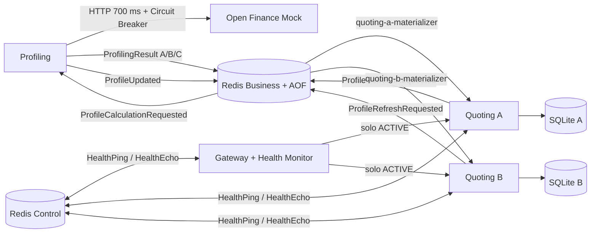
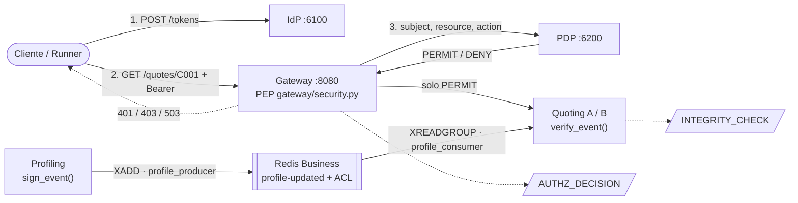

# Solventa Availability Experiment

Experimento reproducible para evaluar si transferencia de estado, vistas materializadas locales y detección asíncrona de fallas sostienen el journey de Cotización bajo las condiciones definidas para ASR-02 y ASR-05.

Un segundo experimento, de seguridad, evalúa AS-4 (confidencialidad) y AS-8 (integridad) sobre el mismo montaje; ver [Experimento de seguridad](#experimento-de-seguridad-as-4--as-8).

El resultado de una ejecución representa evidencia dentro del entorno evaluado. No equivale a una predicción de disponibilidad mensual en producción.

## Hipótesis

- H1, transferencia de estado: un `ProfileUpdated` durable permite cotizar desde SQLite local cuando Profiling está temporalmente indisponible.
- H2, detección: Ping-Echo por el plano de control retira una réplica que no responde dentro de la ventana configurada.
- H3, reintegro: una réplica recuperada pasa por `DOWN -> SHADOW -> ACTIVE` antes de recibir tráfico autoritativo.
- H4, votación: A/B/C publican resultados correlacionados y el Validator decide por consenso o timeout sin mezclar ejecuciones.

## Arquitectura


```mermaid
flowchart LR
    OF[Open Finance Mock]
    P[Profiling]
    RB[(Redis Business + AOF)]
    RC[(Redis Control)]
    QA[Quoting A]
    QB[Quoting B]
    DBA[(SQLite A)]
    DBB[(SQLite B)]
    G[Gateway + Health Monitor]

    P -->|HTTP 700 ms + Circuit Breaker| OF
    QA -->|ProfileRefreshRequested| RB
    QB -->|ProfileRefreshRequested| RB
    RB -->|ProfileCalculationRequested| P
    P -->|ProfilingResult A/B/C| RB
    P -->|ProfileUpdated| RB
    RB -->|quoting-a-materializer| QA
    RB -->|quoting-b-materializer| QB
    QA --> DBA
    QB --> DBB
    G -->|solo ACTIVE| QA
    G -->|solo ACTIVE| QB
    RC <-->|HealthPing / HealthEcho| G
    RC <-->|HealthPing / HealthEcho| QA
    RC <-->|HealthPing / HealthEcho| QB
```

### Componentes

| Componente | Responsabilidad | Estado |
|---|---|---|
| `redis-business` | Streams de negocio con AOF y volumen persistente; ACL por rol en `profile-updated` (AS-8) | Durable dentro del montaje local |
| `redis-control` | Pub/Sub efímero de HealthPing/HealthEcho | Separado del plano de negocio |
| `open-finance-mock` | Modos determinísticos NORMAL, SLOW, HTTP_500, TIMEOUT y DOWN | Inyección controlada |
| `profiling` | Circuit Breaker, caché, estrategias A/B/C, Validator y `ProfileUpdated` | Command + Query experimental |
| `quoting-a/b` | Materializador independiente y journey EDA desde SQLite | Read model local por réplica |
| `gateway` | Routing ACTIVE, failover único, retiro y SHADOW; PEP de autorización (AS-4) | Health Monitor incluido |
| `idp` | Emite JWT de prueba HS256 (AS-4) | `TEST ONLY` |
| `pdp` | Decisión PERMIT/DENY por tenant, scope, dueño y delegación (AS-4) | Sin estado; fail-closed si no responde |

## Decisiones verificables

### Vista local e idempotencia

Cada réplica monta un volumen diferente y configura su propio `SQLITE_PATH`. La tabla `profile_view` nunca se consulta en Redis durante una cotización. La aplicación de eventos usa una transacción `BEGIN IMMEDIATE`, registra `eventId` y solo actualiza cuando la versión entrante es mayor.

Un perfil inexistente o vencido produce `503` con `NO_VALID_PROFILE_AVAILABLE` o `PROFILE_EXPIRED`. `MAX_PROFILE_AGE_SECONDS=300` es un umbral experimental configurable, no un requisito oficial.

### Consumer groups

`quoting-a-materializer` y `quoting-b-materializer` son grupos diferentes. Ambos reciben cada `ProfileUpdated`. Los pendientes se reclaman con `XAUTOCLAIM` después de `PENDING_CLAIM_IDLE_MS`; nunca se utiliza `min_idle_time=0`.

### Journey EDA y baseline síncrono

- `GET /quotes/{customerId}` consulta SQLite local.
- `POST /quotes/{customerId}/request-refresh` publica `ProfileRefreshRequested`.
- `GET /sync/quotes/{customerId}` llama a Profiling y existe únicamente para demostrar la propagación de fallas de la arquitectura anterior.

### Circuit Breaker y fallback

Profiling limita Open Finance mediante `OPEN_FINANCE_TIMEOUT_MS`. Después de `CB_FAILURE_THRESHOLD`, el circuito pasa a OPEN. Al finalizar `CB_RECOVERY_TIMEOUT_SECONDS`, permite una sola prueba HALF_OPEN. Si existe caché vigente, estrategia A usa `CACHE`; si no existe, A reporta error y la política 2/3 todavía puede decidir con B/C.

### Votación por eventos

Cada cálculo publica `ProfileCalculationRequested`. A, B y C consumen mediante grupos independientes y publican `ProfilingResult`. El Validator agrupa por `correlationId`, espera hasta `VOTING_TIMEOUT_MS` y busca el grupo mayoritario dentro de `VOTING_TOLERANCE`.

Para `40, 40, 90`, el resultado es `40` y C queda como outlier. Para `40, 40, timeout`, A/B forman consenso y C aparece en `missingStrategies`.

### Health, failover y SHADOW

El Gateway envía HealthPing por Redis Control. Dos ausencias consecutivas, con la configuración incluida, cambian la réplica a DOWN. El routing utiliza exclusivamente instancias ACTIVE.

Si una instancia falla antes de quedar DOWN, el Gateway hace un solo reintento ante error de transporte contra otra instancia ACTIVE. Una réplica recuperada entra en SHADOW. Los GET autoritativos se comparan con respuestas shadow; la promoción requiere health checks suficientes, tiempo mínimo, validaciones y cero diferencias.

El Docker healthcheck comprueba infraestructura del experimento. Ping-Echo es la táctica arquitectónica bajo evaluación; cumplen objetivos diferentes.

## Ejecución

### Requisitos

- Docker Desktop con Docker Compose.
- Python 3.10 o superior para scripts y pruebas locales.

```bash
git checkout feature/mejoras-experimento
docker compose up --build -d --wait
docker compose ps
```

Puertos host: Gateway `8080`, Profiling `7500`, Quoting A `7002`, Quoting B `7001`, Open Finance `6000`, IdP de prueba `6100`, PDP `6200`, Redis Business `6379` y Redis Control `6380`. Quoting A usa `7002` porque macOS suele reservar `7000` para Control Center; dentro de Docker ambas réplicas escuchan en `7000`.

Comprobación inicial:

```bash
curl -s -X POST http://localhost:7500/profiles/C001/refresh | python -m json.tool
curl -s http://localhost:7002/materialized-profiles/C001 | python -m json.tool
curl -s http://localhost:7001/materialized-profiles/C001 | python -m json.tool
TOKEN=$(curl -s -X POST http://localhost:6100/tokens -H 'Content-Type: application/json' \
  -d '{"sub":"C001","scopes":["quotes:read"]}' | python -c 'import sys,json;print(json.load(sys.stdin)["access_token"])')
curl -s http://localhost:8080/quotes/C001 -H "Authorization: Bearer $TOKEN" | python -m json.tool
```

Desde el experimento de seguridad, el Gateway exige un JWT para `/quotes/*`. El runner y los scripts de carga obtienen un token del IdP de prueba para cada cliente.

## Pruebas automatizadas

```bash
python -m venv .venv
source .venv/bin/activate
pip install -r requirements-dev.txt
pytest -v
```

Con el stack levantado:

```bash
RUN_INTEGRATION=1 pytest -m integration -v
```

Las pruebas unitarias cubren Circuit Breaker, versionado/idempotencia, consenso y la máquina `ACTIVE/DOWN/SHADOW`. Las pruebas de arquitectura verifican separación de buses, grupos y volúmenes independientes, ausencia de HTTP en el refresh EDA y failover acotado.

## Runner E0-E9

```bash
python scripts/run_experiment.py E0
python scripts/run_experiment.py E3
python scripts/run_experiment.py E5
python scripts/run_experiment.py E6
python scripts/run_experiment.py E7
python scripts/run_experiment.py E8
python scripts/run_experiment.py E9
python scripts/run_experiment.py all
```

Cada ejecución guarda `results/E<n>.json` y actualiza `results/summary.csv` y `results/acceptance_matrix.csv`. Un resultado PASS significa que el comportamiento observado cumplió el criterio programado para esa ejecución.

| Escenario | Falla o condición | Evidencia principal |
|---|---|---|
| E0 | Todo disponible | Disponibilidad, throughput, p50/p95/p99 |
| E1 | Open Finance DOWN | Fallback, circuito y continuidad |
| E2 | Open Finance lento | Timeout y contención de latencia |
| E3 | Profiling DOWN | EDA disponible y baseline síncrono fallando |
| E4 | Materializador A pausado | Pendientes reclamados y versiones A/B iguales |
| E5 | Quoting B DOWN | B retirado, failover y continuidad por A |
| E6 | Quoting B recuperado | Secuencia DOWN-SHADOW-ACTIVE |
| E7 | A=40, B=40, C=90 | C marcado como outlier |
| E8 | C no responde | Decisión A/B después del timeout |
| E9 | Redis Business DOWN | Cotización desde SQLite y salud por Redis Control |

## Experimento de seguridad (AS-4 / AS-8)

Segundo experimento sobre el mismo montaje, centrado en las historias de seguridad **AS-4 [Confidencialidad]** y **AS-8 [Integridad]**. Sigue el mismo método que E0-E9: hipótesis, montaje reproducible, escenarios ejecutables, evidencia en `results/*.json` y un guion de video. La lógica nueva es aditiva: E0-E9 siguen en verde con la capa de seguridad activa.

### Hipótesis del experimento

- **H-AS4, confidencialidad.** El Gateway, apoyado en un IdP de prueba y en un PDP externo, impide que un sujeto acceda a perfiles o cotizaciones de otro cliente en tres casos: si no tiene una identidad válida, si le falta el `scope` necesario o si no cumple `subject.customerId == owner.customerId` y tampoco tiene una delegación explícita. Si el PDP no responde, el Gateway **deniega** (falla cerrado).
- **H-AS8, integridad.** El evento `ProfileUpdated` viaja firmado con HMAC-SHA256 desde Perfilamiento hasta Cotización. Cotización detecta y rechaza, antes de calcular la prima, cualquier evento alterado, sin firma o con un `keyId` desconocido, y lo registra en auditoría. La ACL de Redis Streams impide publicar o consumir en `profile-updated` sin el rol correcto.

Una hipótesis se acepta si todos sus escenarios cumplen el criterio programado. Además, E0-E9 deben seguir cumpliendo los suyos.


```mermaid
flowchart LR
    C(["Cliente / Runner"]) -->|"1. POST /tokens"| IDP["IdP :6100"]
    C -->|"2. GET /quotes/C001 + Bearer"| PEP["Gateway :8080<br/>PEP gateway/security.py"]
    PEP -->|"3. subject, resource, action"| PDP["PDP :6200"]
    PDP -->|"PERMIT / DENY"| PEP
    PEP -->|"solo PERMIT"| Q["Quoting A / B<br/>verify_event()"]
    PEP -.->|"401 / 403 / 503"| C
    P["Profiling<br/>sign_event()"] -->|"XADD · profile_producer"| RB[["Redis Business<br/>profile-updated + ACL"]]
    RB -->|"XREADGROUP · profile_consumer"| Q
    PEP -.-> AUD[/"AUTHZ_DECISION"/]
    Q -.-> AUD2[/"INTEGRITY_CHECK"/]
```

### Componentes y credenciales de prueba

| Componente | Ubicación | Puerto | Responsabilidad |
|---|---|---|---|
| IdP de prueba | `security/idp/app.py` | 6100 | Emite JWT HS256 con `sub`, `customerId`, `tenantId`, `scopes`, `exp`, `kid` (`POST /tokens`). Es de prueba: emite cualquier token que se le pida |
| PDP | `security/pdp/app.py` | 6200 | Decide `PERMIT`/`DENY` (`POST /decisions`). Evalúa en orden: tenant, scope, dueño y delegación. Recibe los claims verificados, nunca el JWT |
| PEP del Gateway | `gateway/security.py` | 8080 | Valida el JWT localmente (firma, `exp`, `aud`, `iss`, `kid`), resuelve el dueño a partir de la ruta y consulta al PDP con `PDP_TIMEOUT_MS=300`. Si no hay respuesta, `503 PDP_UNAVAILABLE`. Las rutas no mapeadas se deniegan |
| Firmante | `profiling/event_signing.py` | — | Agrega `payloadHash`, `producerId`, `keyId`, `algorithm`, `schemaVersion` antes del `XADD` |
| Verificador | `quoting/event_verification.py` | — | Verifica antes de `repository.apply_event()`. Si falla, `XACK`, descarte sin reintento y sin registro en `processed_events` |
| ACL de Redis Business | `redis/users.acl` | 6379 | `default` solo `PING`. En `profile-updated`, `profile_producer` solo `XADD` y `profile_consumer` solo `XGROUP CREATE`, `XREADGROUP`, `XACK`, `XAUTOCLAIM` |
| Auditoría | `log_event` existente | — | `AUTHZ_DECISION` en el Gateway e `INTEGRITY_CHECK` en Quoting. Nunca incluyen el JWT ni secretos |

Rutas protegidas y acción que exige cada una:

| Método y ruta en el Gateway | Acción (scope) |
|---|---|
| `GET /quotes/{customerId}` | `quotes:read` |
| `GET /sync/quotes/{customerId}` | `quotes:read` |
| `POST /quotes/{customerId}/request-refresh` | `profiles:refresh` |
| `GET /profiles/{customerId}`, `GET /materialized-profiles/{customerId}` | `profiles:read` |

`/gateway/status`, `/metrics`, `/health` y `/admin/*` quedan fuera de esta capa, igual que antes. Una delegación se expresa con el scope `delegated:<customerId>` y **no** reemplaza el scope de la acción.

Credenciales de prueba. Todas se definen en `docker-compose.yaml`, llevan el prefijo `TEST-ONLY` y no son secretos reales:

| Credencial | Identificador | Valor (`TEST ONLY`) | Dónde se usa |
|---|---|---|---|
| Llave HS256 del IdP | `kid=idp-test-2026-09` | `TEST-ONLY-idp-hs256-not-a-real-secret-2026-09` | `IDP_SIGNING_KEY` (idp), `IDP_KEYS_JSON` (gateway) |
| Llave HMAC de eventos | `keyId=test-key-2026-09` | `TEST-ONLY-hmac-profile-updated-2026-09` | `HMAC_KEY` (profiling), `KNOWN_KEYS_JSON` (quoting-a/b) |
| Usuario Redis productor | `profile_producer` | `TEST-ONLY-redis-profile-producer-pw-2026-09` | `REDIS_BUSINESS_URL` de profiling |
| Usuario Redis consumidor | `profile_consumer` | `TEST-ONLY-redis-profile-consumer-pw-2026-09` | `REDIS_BUSINESS_URL` de quoting-a/b |
| Usuario Redis anónimo | `default` | sin contraseña, solo `PING` | Healthcheck de Docker |

Otros parámetros: `IDP_ISSUER=solventa-test-idp`, `IDP_AUDIENCE=solventa-gateway`, `RESOURCE_TENANT_ID=solventa`. Los tokens duran 3600 s por defecto (`expiresIn` en `POST /tokens`). `redis/users.acl` guarda solo los hashes SHA-256 de las contraseñas. Los endpoints `POST /admin/integrity/signing-key` (profiling) y `POST /admin/integrity/known-keys` (quoting) existen solo para la prueba de rotación SEC-I6, y nunca devuelven ni registran el secreto.

Obtener un token y consultar como dueño:

```bash
TOKEN=$(curl -s -X POST http://localhost:6100/tokens -H 'Content-Type: application/json' \
  -d '{"sub":"C001","scopes":["quotes:read"]}' | python3 -c 'import sys,json;print(json.load(sys.stdin)["access_token"])')
curl -s http://localhost:8080/quotes/C001 -H "Authorization: Bearer $TOKEN"
```

### Escenarios de confidencialidad (AS-4)

La columna "Observado" corresponde a la validación del 26 de septiembre de 2026 contra el stack completo. El detalle de cada paso está en el [guion de validación](docs/video-demo-security.md).

| ID | Dado / Cuando | Criterio programado | Observado | Estado |
|---|---|---|---|---|
| SEC-C0 | JWT de C001 con `quotes:read` → `GET /quotes/C001` | `200` en todas las llamadas | 20/20 `200`, availability=100% | PASS |
| SEC-C1 | Sin header `Authorization` | `401 MISSING_TOKEN` | `401 MISSING_TOKEN` | PASS |
| SEC-C2 | JWT con `exp` vencido | `401 TOKEN_EXPIRED` | `401 TOKEN_EXPIRED` | PASS |
| SEC-C3 | JWT válido de C002 pide `/quotes/C001` | `403 OWNERSHIP_MISMATCH` | `403 OWNERSHIP_MISMATCH` | PASS |
| SEC-C4 | JWT de C001 con solo `profiles:read` | `403 INSUFFICIENT_SCOPE` | `403 INSUFFICIENT_SCOPE` | PASS |
| SEC-C5 | JWT de C002 con `quotes:read` + `delegated:C001` | `200` y auditoría `PERMIT/DELEGATION` | `200`, `AUTHZ_DECISION` PERMIT/DELEGATION | PASS |
| SEC-C6 | `tenantId` del token ≠ tenant del recurso | `403 TENANT_MISMATCH` | `403 TENANT_MISMATCH` | PASS |
| SEC-C7 | `docker compose stop pdp` y JWT válido | `503 PDP_UNAVAILABLE`, nunca `200` | 5/5 `503 PDP_UNAVAILABLE`; `200` al volver el PDP | PASS |
| SEC-C8 | JWT con un carácter central de la firma alterado | `401 INVALID_SIGNATURE` | `401 INVALID_SIGNATURE` | PASS |
| SEC-C9 | Carga de 6 s, 8 workers, JWT por cliente | availability=100% y overhead reportado | 100%, 3617 requests, p95 18.26 ms, 0 DENY, autorización media 4.9 ms | PASS |

SEC-C9 mide el costo de autorización dentro del Gateway como `authz_duration_us_total / authz_checks`. No se compara contra E0 porque E0 ahora también pasa por la autorización.

### Escenarios de integridad (AS-8)

| ID | Dado / Cuando | Criterio programado | Observado | Estado |
|---|---|---|---|---|
| SEC-I0 | Refresh normal de C001 | Firmado, verificado y `APPLIED` en A y B | `keyId=test-key-2026-09`, verified A=1 B=1, `APPLIED` | PASS |
| SEC-I1 | `riskScore` alterado conservando el `payloadHash` original, publicado con `XADD` directo | `SIGNATURE_MISMATCH` en A y B; vista y prima sin cambios | Rechazado en A y B, prima 345.0 → 345.0 | PASS |
| SEC-I2 | Evento sin `payloadHash`/`keyId`/`algorithm`/`producerId`/`schemaVersion` | `MISSING_INTEGRITY_FIELDS` | Rechazado en A y B, vista sin cambios | PASS |
| SEC-I3 | Evento firmado con `keyId=test-key-rogue` | `UNKNOWN_KEY` | Rechazado en A y B, vista sin cambios | PASS |
| SEC-I4 | `XADD profile-updated` anónimo y con rol consumidor | `NOPERM`, nada consumido | `NOPERM` ×2, `events_consumed` +0 | PASS |
| SEC-I5 | `XREADGROUP`/`XRANGE` anónimo y con rol productor | `NOPERM` | `NOPERM` ×3 | PASS |
| SEC-I6 | Rotación a `test-key-2026-10` con un evento de la llave anterior pendiente | Ambas llaves verifican, 0 rechazos | Quoting A verificó 2026-09=1 y 2026-10=1, 0 rechazos | PASS |
| SEC-I7 | Reenvío del mismo evento con firma válida | `DUPLICATE`, 0 rechazos | `DUPLICATE` en A y B, 0 rechazos | PASS |
| SEC-I8 | Carga de 6 s + refrescos cada ~0.2 s | 100%, todos verificados, 0 rechazos | 100%, 24 firmados y 24 verificados por réplica, p95 18.15 ms | PASS |
| SEC-I9 | Rechazos forzados I1 + I2 + I3 | 3 razones auditadas, 0 secretos en logs | 6 registros `INTEGRITY_CHECK`, 3597 líneas revisadas, 0 fugas | PASS |

Decisiones de diseño de los escenarios:

- **El evento falsificado es más nuevo que el vigente.** SEC-I1, SEC-I2 y SEC-I3 lo publican con un `eventId` nuevo y una `version` mayor. Así, ni la idempotencia ni el versionado pueden ocultar una verificación ausente: sin ella, el evento se aplicaría.
- **El atacante tiene acceso al bus, pero no a la llave.** Los eventos falsificados se inyectan con las credenciales `profile_producer`, lo que muestra que la ACL y la firma son defensas independientes.
- **Un evento rechazado no bloquea al legítimo.** No se registra en `processed_events`, así que el evento legítimo con el mismo `eventId` se aplica después.
- **Contrato firmado:** ver [docs/events.md](docs/events.md#integridad-as-8-schemaversion-11).

### Ejecución

```bash
python3 scripts/run_experiment.py SEC-C3            # un escenario
python3 scripts/run_experiment.py all-security      # SEC-C0..C9 y SEC-I0..I9 (~35 s)
python3 scripts/run_experiment.py all-experiments   # E0..E9 y después SEC-*
RUN_INTEGRATION=1 pytest -m integration tests/security -v
```

`all` sigue ejecutando solo `E0`-`E9`. Los resultados quedan en `results/SEC-*.json` y se agregan como filas a `summary.csv` y `acceptance_matrix.csv`, con las mismas columnas. Para no regresión, ejecuta `all` y después `all-security`: en la validación, ambas corridas terminaron con 30/30 PASS.

## Carga con Locust

```bash
python -m venv .venv-locust
source .venv-locust/bin/activate
pip install -r load-tests/requirements.txt
TARGET_HOST=http://localhost:8080 CUSTOMER_POOL=C001,C002,C003 \
  locust -f load-tests/locustfile.py --users 20 --spawn-rate 5
```

Abre `http://localhost:8089`. Precarga los clientes con E0 antes de iniciar carga; los clientes sin perfil válido deben fallar funcionalmente y no se contabilizan como disponibilidad exitosa.

## Endpoints de control del experimento

Open Finance lento:

```bash
curl -s -X POST http://localhost:6000/admin/mode \
  -H 'Content-Type: application/json' \
  -d '{"mode":"SLOW","latencyMs":1500}'
```

Votación discrepante:

```bash
curl -s -X POST http://localhost:7500/admin/voting-scenario \
  -H 'Content-Type: application/json' \
  -d '{"A":{"mode":"NORMAL","score":40},"B":{"mode":"NORMAL","score":40},"C":{"mode":"NORMAL","score":90}}'
```

Estado del Gateway y métricas:

```bash
curl -s http://localhost:8080/gateway/status | python -m json.tool
curl -s http://localhost:7500/metrics | python -m json.tool
curl -s http://localhost:7002/metrics | python -m json.tool
```

Los endpoints `/admin/*` son exclusivos del mock y del entorno experimental.

## Criterios de aceptación

| Hipótesis | Escenario | Métrica | Criterio programado |
|---|---|---|---|
| H1 | E3 | availability | 100% para perfiles precargados; baseline sync falla |
| H1 | E4 | pending_recovered | Al menos un pendiente y misma versión final en A/B |
| H1 | E9 | availability | 100% para perfiles vigentes en SQLite |
| H2 | E5 | estado y disponibilidad | B=DOWN y 100% de cotizaciones funcionales |
| H3 | E6 | transiciones | SHADOW observado antes de ACTIVE |
| H4 | E7 | outlier | finalScore=40, outlierStrategies=[C] |
| H4 | E8 | timeout | finalScore=40, missingStrategies=[C], duración <2.5 s |
| Equipo | E0/E4 | propagación | p95 ≤2 s, umbral experimental |

## Logs y contratos

Los servicios imprimen JSON estructurado con timestamp, servicio, instancia, evento, correlación y resultado cuando aplica.

- Contratos: [docs/events.md](docs/events.md)
- Guion de video: [docs/video-demo.md](docs/video-demo.md)
- Guion de video de seguridad: [docs/video-demo-security.md](docs/video-demo-security.md)

## Limitaciones

- Redis Business usa AOF y un volumen local. Esto no demuestra durabilidad multi-región ni alta disponibilidad de un clúster Redis.
- Redis Control usa Pub/Sub efímero; perder mensajes de health forma parte de la semántica de detección.
- Las métricas residen en memoria y se reinician con cada contenedor.
- El runner genera evidencia en una sola máquina y durante intervalos cortos.
- Flask se ejecuta con su servidor integrado porque el objetivo es un experimento local, no un despliegue productivo.
- El IdP y el PDP son de prueba: HS256 con llave compartida y sin JWKS, revocación ni mTLS entre servicios. `redis-control` queda sin ACL, fuera del alcance de AS-8.
- SQLite representa una vista local por réplica. El experimento no evalúa replicación de la base ni crecimiento masivo.

## Limpieza

```bash
docker compose down
```

Para eliminar también AOF, vistas SQLite y resultados de estado persistente de Docker:

```bash
docker compose down -v
```
